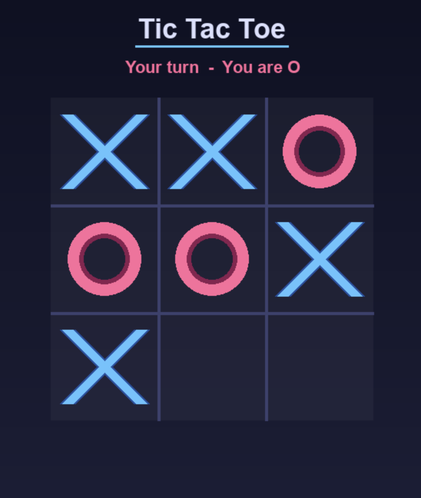

# Solving Tic Tac Toe using Minimax
---
## Overview
This was a quick half day work of implementing the MiniMax Algorithm to solve TicTacToe with a bonus of a very classy object oriented code structure.

> Except for humanPlayer.py, every single other character of code is written by me! I couldn't be bothered to make the UI, so claude did the job for me...

### Gameplay Preview
<div align="center">
  
</div>

---

## Project Structure

```text
├── main.py           # Game entry point & configuration
├── engine.py         # Referee logic & game flow
├── board.py          # State tracking & move validation
├── players/          # Extensible player architectures
│   ├── humanPlayer.py   # Interactive Pygame UI player
│   ├── minimax.py       # Strategic AI logic
│   └── randomPlayer.py  # Simple randomized agent
└── requirements.txt  # Project dependencies
```
